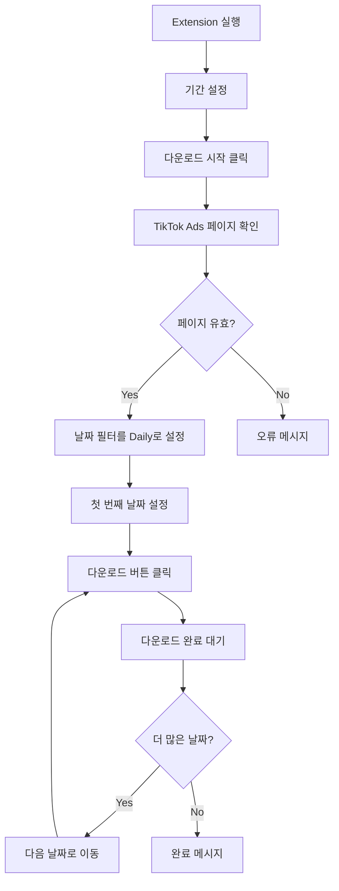

# Product Requirements Document (PRD)
# TikTok Ads Manager Auto Downloader Chrome Extension

## 1. 제품 개요

### 1.1 제품명
TikTok Ads Manager Auto Downloader

### 1.2 제품 목적
TikTok Ads Manager의 데이터를 자동으로 일별(Daily) 단위로 다운로드하는 Chrome Extension으로, 반복적인 수동 다운로드 작업을 자동화하여 업무 효율성을 향상시킨다.

### 1.3 대상 사용자
- TikTok Ads Manager를 사용하는 마케팅 담당자
- 데이터 분석팀
- Cosduck Agency 운영팀

## 2. 핵심 기능

### 2.1 기간 설정 기능
- **설명**: 사용자가 다운로드할 데이터의 시작일과 종료일을 설정
- **입력 형식**: Date Picker UI (YYYY-MM-DD)
- **제약사항**: 
  - 최대 90일까지 선택 가능
  - 과거 날짜만 선택 가능 (당일 제외)

### 2.2 자동 다운로드 실행
- **설명**: 설정된 기간 내의 모든 날짜에 대해 일별로 데이터를 자동 다운로드
- **프로세스**:
  1. 날짜 필터를 "Daily"로 설정
  2. 시작일부터 종료일까지 하루씩 순차적으로 날짜 변경
  3. 각 날짜별로 다운로드 버튼 클릭
  4. 다운로드 완료 대기 후 다음 날짜로 이동

### 2.3 진행 상태 표시
- **진행률 표시**: 전체 날짜 중 현재 진행 상황 (예: 5/30)
- **현재 다운로드 중인 날짜 표시**
- **예상 완료 시간 표시**
- **다운로드 성공/실패 로그**

### 2.4 다운로드 설정
- **파일 저장 위치**: Chrome 기본 다운로드 폴더
- **파일명 규칙**: `TikTokAds_${account}_${date}_${timestamp}.csv`
- **다운로드 간격**: 각 다운로드 사이 3-5초 대기 (서버 부하 방지)

## 3. 기술 사양

### 3.1 Chrome Extension 구조
```
tiktok-ads-downloader/
├── manifest.json           # Extension 설정
├── popup/
│   ├── popup.html         # Extension UI
│   ├── popup.css          # 스타일
│   └── popup.js           # UI 로직
├── content/
│   └── content.js         # 페이지 조작 스크립트
├── background/
│   └── background.js      # 백그라운드 작업 처리
└── icons/                 # Extension 아이콘
```

### 3.2 필요 권한 (manifest.json)
```json
{
  "permissions": [
    "activeTab",
    "storage",
    "downloads",
    "tabs"
  ],
  "host_permissions": [
    "https://ads.tiktok.com/*"
  ]
}
```

### 3.3 주요 DOM 선택자 (예상)
- 날짜 필터: `[data-testid="date-picker"]`
- Daily 옵션: `[data-value="daily"]`
- 다운로드 버튼: `[data-testid="export-button"]`
- 날짜 입력 필드: `input[type="date"]`

## 4. 사용자 인터페이스

### 4.1 Extension Popup UI
```
┌─────────────────────────────────┐
│  TikTok Ads Auto Downloader     │
├─────────────────────────────────┤
│                                 │
│  기간 설정                      │
│  시작일: [____-__-__]           │
│  종료일: [____-__-__]           │
│                                 │
│  [다운로드 시작] [중지]         │
│                                 │
│  진행 상황: 0/0                 │
│  ▱▱▱▱▱▱▱▱▱▱▱▱▱▱▱▱▱▱▱▱         │
│                                 │
│  로그:                          │
│  ┌────────────────────────┐    │
│  │                        │    │
│  │                        │    │
│  └────────────────────────┘    │
└─────────────────────────────────┘
```

### 4.2 상태 표시
- **대기**: 회색 아이콘
- **실행 중**: 파란색 애니메이션 아이콘
- **완료**: 초록색 체크 아이콘
- **오류**: 빨간색 X 아이콘

## 5. 작업 흐름

### 5.1 메인 플로우


### 5.2 오류 처리
- **네트워크 오류**: 3회 재시도 후 다음 날짜로 이동
- **페이지 로딩 실패**: 10초 대기 후 재시도
- **다운로드 실패**: 실패 로그 기록 후 계속 진행
- **사용자 중단**: 현재 진행 상황 저장 후 종료

## 6. 데이터 저장

### 6.1 Chrome Storage 사용
```javascript
{
  "settings": {
    "downloadInterval": 3000,
    "maxRetries": 3
  },
  "progress": {
    "startDate": "2025-08-01",
    "endDate": "2025-08-31",
    "currentDate": "2025-08-15",
    "completed": ["2025-08-01", "2025-08-02"],
    "failed": []
  },
  "logs": [
    {
      "timestamp": "2025-08-13T10:30:00",
      "date": "2025-08-01",
      "status": "success",
      "message": "Downloaded successfully"
    }
  ]
}
```

## 7. 보안 및 제한사항

### 7.1 보안
- TikTok Ads Manager의 인증 세션 활용
- 개인정보나 인증 정보는 저장하지 않음
- HTTPS 통신만 허용

### 7.2 제한사항
- TikTok Ads Manager에 로그인된 상태에서만 작동
- 브라우저가 활성 상태여야 함
- 한 번에 하나의 계정만 처리 가능
- TikTok UI 변경 시 업데이트 필요

## 8. 성공 지표

### 8.1 기능적 성공 지표
- 95% 이상의 다운로드 성공률
- 날짜당 평균 다운로드 시간 10초 이내
- 오류 발생 시 자동 복구율 80% 이상

### 8.2 사용자 경험 지표
- 수동 대비 80% 시간 절감
- 사용자 만족도 4.5/5.0 이상
- 일일 활성 사용자 수 증가

## 9. 개발 단계

### Phase 1: MVP (2주)
- 기본 날짜 설정 기능
- 단일 날짜 자동 다운로드
- 간단한 진행 상태 표시

### Phase 2: 확장 기능 (2주)
- 다중 날짜 연속 다운로드
- 오류 처리 및 재시도 로직
- 상세 로그 및 진행률 표시

### Phase 3: 최적화 (1주)
- 성능 최적화
- UI/UX 개선
- 버그 수정 및 안정화

## 10. 리스크 및 대응 방안

### 10.1 기술적 리스크
| 리스크 | 발생 가능성 | 영향도 | 대응 방안 |
|--------|------------|--------|-----------|
| TikTok UI 변경 | 높음 | 높음 | 선택자 설정을 외부 파일로 관리, 빠른 업데이트 체계 구축 |
| Rate Limiting | 중간 | 중간 | 다운로드 간격 조절 기능, 지수 백오프 구현 |
| 브라우저 충돌 | 낮음 | 높음 | 자동 복구 메커니즘, 진행 상황 저장 |

### 10.2 사용자 리스크
| 리스크 | 발생 가능성 | 영향도 | 대응 방안 |
|--------|------------|--------|-----------|
| 복잡한 사용법 | 낮음 | 중간 | 직관적 UI, 도움말 제공 |
| 데이터 손실 | 낮음 | 높음 | 다운로드 검증, 백업 옵션 |

## 11. 향후 로드맵

### v2.0 (3개월 후)
- 다중 계정 지원
- 스케줄링 기능 (매일 자동 실행)
- 다운로드 데이터 자동 병합

### v3.0 (6개월 후)
- 다른 광고 플랫폼 지원 (Facebook, Google Ads)
- 클라우드 저장소 연동
- API 통합 옵션

## 12. 부록

### 12.1 참고 자료
- Chrome Extension API Documentation
- TikTok Ads Manager 사용 가이드
- Web Scraping Best Practices

### 12.2 용어 정의
- **Extension**: Chrome 브라우저 확장 프로그램
- **Content Script**: 웹 페이지에 주입되어 실행되는 스크립트
- **Background Script**: 백그라운드에서 실행되는 스크립트
- **Manifest**: Extension의 설정 파일

---

**문서 버전**: 1.0  
**작성일**: 2025-08-13  
**작성자**: Cosduck Agency Development Team  
**검토자**: Product Manager  
**승인자**: Project Owner